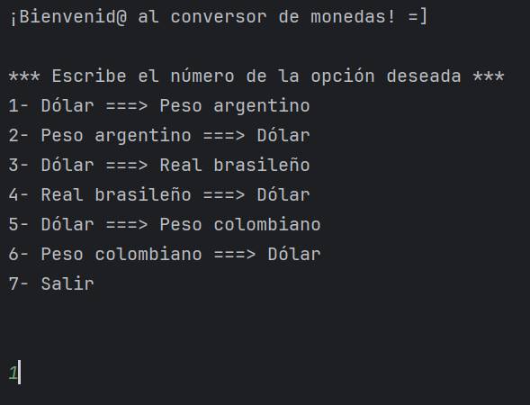
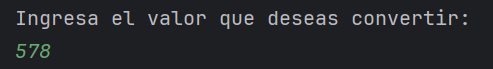
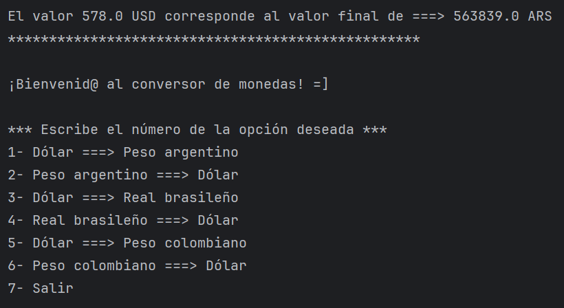
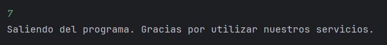

<em> Descripción del proyecto </em>

El Conversor de Monedas es una aplicación de consola desarrollada en Java que permite a los usuarios convertir entre diferentes monedas usando datos actualizados desde una API de tipo de cambio. La aplicación interactúa con el usuario a través de un menú en el que se puede elegir la conversión deseada y realizar los cálculos en tiempo real.

<em> Funcionalidades </em>

• Convertir entre diferentes monedas:

-Dólar (USD) a Peso Argentino (ARS)

-Peso Argentino (ARS) a Dólar (USD)

-Dólar (USD) a Real Brasileño (BRL)

-Real Brasileño (BRL) a Dólar (USD)

-Dólar (USD) a Peso Colombiano (COP)

-Peso Colombiano (COP) a Dólar (USD)

• Conexión con la API Exchange Rate para obtener las tasas de conversión actuales.

• Cálculo y visualización del valor convertido.

• Interfaz simple y amigable a través de consola.

<em> Cómo usarlo </em>

1- Descarga o clona este repositorio en tu máquina local con el siguiente comando:

git clone https://github.com/usuario/conversor-monedas.git

2- Asegurate de tener Java instalado. Si no lo tenés, podes descargarlo acá https://www.oracle.com/java/technologies/downloads/#java11

3- Compila el proyecto desde la terminal o un entorno de desarrollo:

javac Principal.java

4- Ejecuta la aplicación:

java Principal

¡Listo! Ya podes comenzar a usar nuestro Conversor de monedas.

Va a aparecer un menú donde podrás elegir la conversión de tu preferencia, ingresar el valor a convertir y obtener el resultado al instante.

Si tenes algún problema, duda o sugerencia, podes encontrar ayuda en las siguientes vías:

Contacto directo: paulasofiasingh@gmail.com

<em> Autor del proyecto </em>

Paula Singh - Desarrolladora Backend Trainee